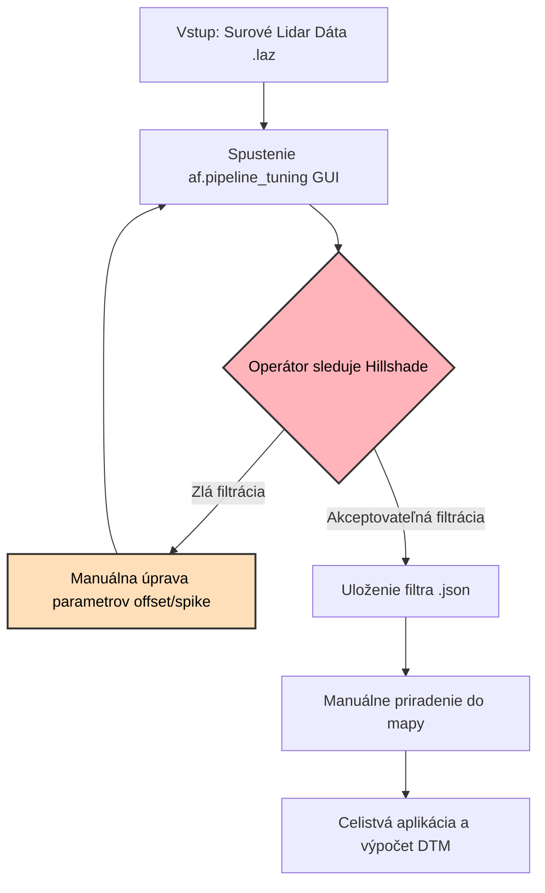
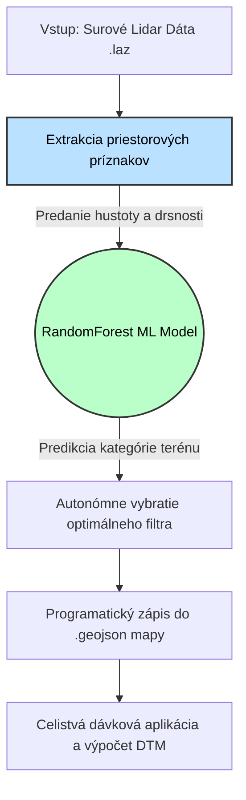

# Porovnanie prístupov: Manuálny operátor vs. Automatizované ML riešenie

Pre názornú ukážku tvojho riešenia (napr. do prezentácie alebo obhajoby semestrálnej práce) je najlepšie ukázať priame štrukturálne rozdiely. Kým pôvodný prístup v AFwizarde si vyžaduje neustálu kognitívnu záťaž operátora, tvoje ML riešenie túto slučku láme a škáluje proces filtrácie.

## 1. Architektonické schémy oboch modelov

Tieto diagramy (tzv. Mermaid grafy) znázorňujú presný tok dát.

### A. Súčasný stav (Manuálna vizuálna spätná väzba)

*Tento proces je brzdou – vyžaduje človeka v slučke ("Human in the Loop"). Ak je letových úsekov lesa sto, operátor musí ladiť sto izolovaných zón.*

### B. Tvoje autonómne ML riešenie

*Tento proces je priamočiary – model robí to isté čo vizuálny kortex operátora. Vyhodnotí geometriu zeme zo vzoriek a priradí najlepšie ladiaci filter na tisíckach polygónov za niekoľko sekúnd.*

---

## 2. Priame tabuľkové porovnanie na obhajobu práce

Kľúčové body, ktorými môžeš obhájiť výsledky svojho semestrálneho zadania:

| Metrika / Prístup | Pôvodný AFwizard (Ľudská spätná väzba) | Tvoj navrhnutý systém (ML Automatizácia) |
| :--- | :--- | :--- |
| **Závislosť na čase** | Vysoká (5 – 15 minút na jeden polygón). Ladiť celú republiku trvá mesiace. | **Nízka** (Stotiny sekundy na polygón, obmedzené len výkonom procesora). |
| **Reprodukovateľnosť** | Nízka (Dvakrát ladiaci operátor môže vybrať dva vizuálne podobné, no výpočtovo iné filtre). | **Absolútna** (Zhodný ML model a rovnaké dáta vrátia vždy matematicky zhodnú iteráciu filtra). |
| **Hľadanie optima (DTM)** | Subjektívne, riadené ľudským okom na základe vizualizácie tienovania. | **Objektívne**, učené oproti simulovanej virtuálnej `Ground Truth` (cez HELIOS++). |
| **API Volanie** | Blokuje spustenie programu interaktívnymi UI widgetmi. | Výhradne programatický blok kódu – takzvaný **Headless spúšťač**, kompatibilný so serverovým/Cloud spustením (Docker). |

## 3. Príklad ukážky kódu na demonštráciu

Požiadaj vyučujúceho, nech si porovná koľko námahy stojí tento úkon v kóde:

#### Kód, ktorý píše operátor pre manuálne ladenie:
```python
# Operátor musí vyvolať na obrazovku Widget, sadnúť si, a preklikávať šupátka, aby našiel ten správny algoritmus
tuning = af.pipeline_tuning(dataset_Sta, segmentation_Sta)
# Čaká sa neurčitý čas...
```

#### Náš kód, ktorý prebehne izolovanie za nanosekundu:
```python
# Kód natiahne natrénovaný ML mozog, bez váhania zistí čo sedí do segmentu, nakopíruje a aplikuje DTM filter naprieč celým mestom
best_pipeline = optimizer.predict_best_filter(terrain_features)
segment['properties']['pipeline'] = best_pipeline
```
